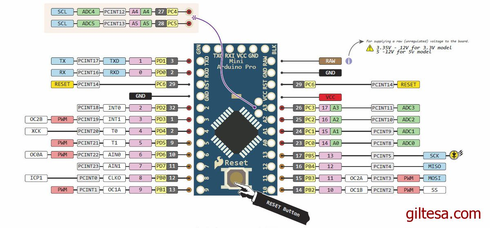
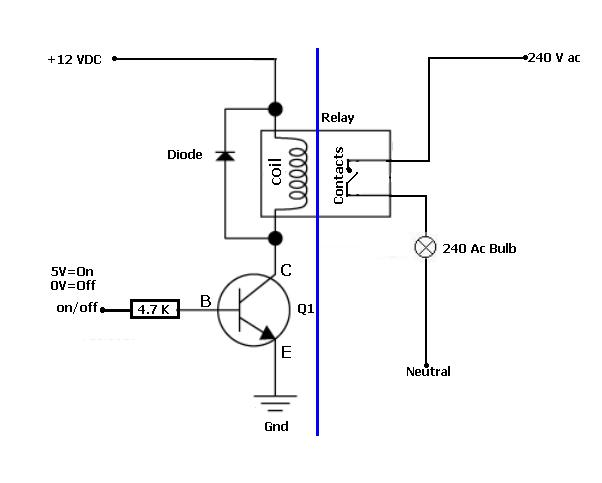

# Simon-Says-Vault
Arduino project to gamify a shop bought locker

Keypad rows / columns

|   | 1 | 4 | 6 |
|---|---|---|---|
| 2 | 1 | 2 | 3 |
| 3 | 4 | 5 | 6 |
| 5 | 7 | 8 | 9 |
| 7 | C | 0 | E |

Cols=1,4,6
Rows=2,3,5,7

